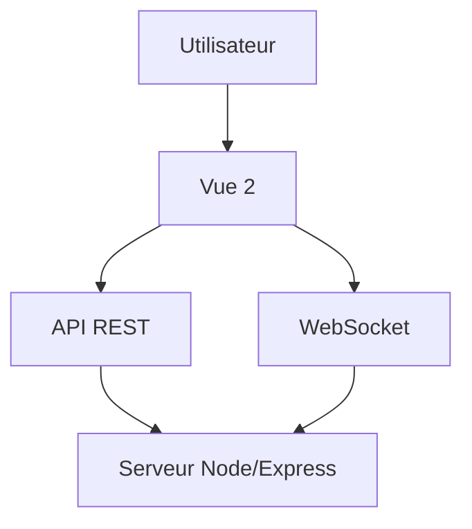
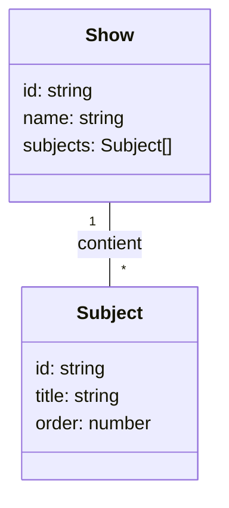

# Architecture du projet GIRR Windsurf (Vue 2)

## Modèles principaux

## Routes principales

- `/shows` : liste des émissions
- `/shows/:id` : détail d'une émission
- `/config` : page de configuration

## Composants inspirés de TwitchToast
- Overlay dynamique
- Notifications en temps réel
- Titrage personnalisable
- Effets visuels (glitch, fondu, etc.)

Voir : https://github.com/codlab/TwitchToast
